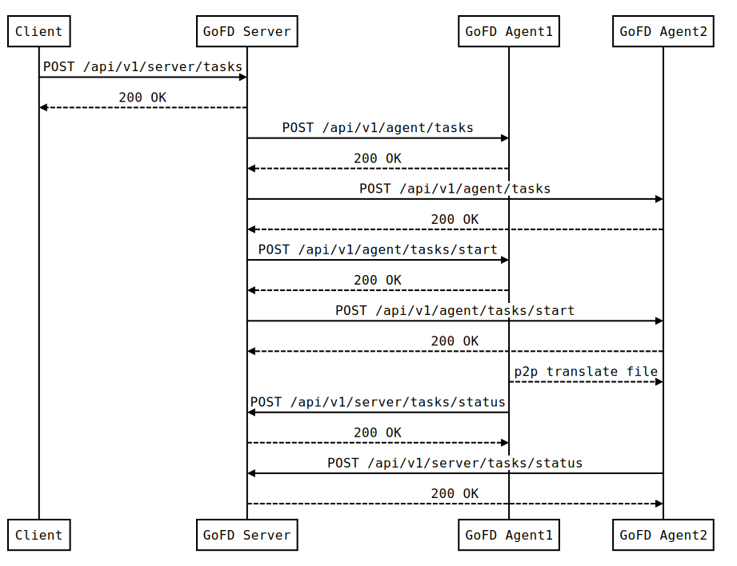
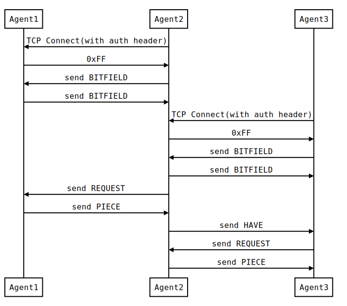

GoFD
==========

## 简介

GoFD是一个使用Go语言开发，集中控制的文件分发系统，用于在一个大规模业务系统文件分发。
系统采用C/S结构，S端负责接收分发任务，把任务下发给C端，C端之间采用P2P技术节点之间共享加速下载。
P2P部分代码参考了[Taipei-Torrent](https://github.com/jackpal/Taipei-Torrent/)。
P2P是一个简化版本的BT协议实现，只使用了其中四个消息（HAVE，REQUEST，PIECE, BITFIELD），并不与BT协议兼容。

与BT软件不一样的是，GoFD是一个P2SP系统，固定存在S端，用于做文件下载源，S端也是集中控制端。
S端与BT的Tracker机制也不一样，它不会维护节点的已下载的文件信息。C端下载文件完成之后也不会再做为种子。
节点之间也没有BT的激励机制，所以没有CHOKE与UNCHOKE消息。


## 第三方依赖

 * Web框架：[echo](https://github.com/labstack/echo)
 * 日志：[seelog](https://github.com/cihub/seelog)
 * 工具库（Cache,Crypto等）：[gokits](https://github.com/xtfly/gokits)
 * 配置（YAML）：[yaml.v2](https://gopkg.in/yaml.v2)

## 使用方式

### 下载依赖与GoFD

    go get github.com/labstack/echo
    go get github.com/labstack/gommon
    go get github.com/valyala/fasthttp
    go get golang.org/x/net # 需要翻墙或git clone github.com/golang/net
    go get github.com/dgrijalva/jwt-go
    go get github.com/cihub/seelog
    go get gopkg.in/yaml.v2
    go get github.com/xtfly/gokits
    go get github.com/xtfly/gofd

### 修改配置

#### 配置日志

日志是采用seelog开源库，配置格式参考[seelog format](https://github.com/cihub/seelog/wiki/Formatting)。

#### 配置Server与Agent

GoFD的Server与Agent的配置采用Yaml格式，其中涉及到文件路径需要采用绝对路径，Server样例如下：

```
name: server #名称
log: /Users/xiao/gofd/config/log.xml #日志配置文件绝对路径
net:
    ip: 127.0.0.1 #监听的IP
    mgntPort: 45000 #管理端口，用于接收客户端的创建任务等Rest接口
    dataPort: 45001 #服务端数据下载端口
    agentMgntPort: 45010 #Agent端的管理端口，用于接收Server下载的管理Rest接口
    agentDataPort: 45011 #Agent端的数据下载端口
    tls:  #管理端口的TLS配置，如果没有配置，则管理端口是采用HTTP
        cert: /Users/xiao/server.crt
        key: /Users/xiao/server.key
auth:
    username: gofd #管理端口与数据端口用于认证的用户名
    passowrd: yrsK+2iiwPqecImH7obTUm1vhnvvQzFmYYiOz5oqaoc= #管理端口与数据端口用于认证的密码
    factor: 9427e80d # passwd加密密钥因子
    crc: 63F7  # passwd加密密钥因子的校验码
contorl:
    speed: 10  # 流量控制，单位为MBps
    cacheSize: 50 # 文件下载的内存缓存大小，单位为MB
    maxActive: 10 # 并发的任务数
```

Agent配置样例如下，其中Agent需要配置`downdir`，用于存放下载的文件。`contorl.speed`不需要配置，由Server在创建任务时传给Agent。

```
name: agent
downdir: /Users/xiao/download
log: /Users/xiao/Go/src/github.com/xtfly/gofd/config/log.xml
net:
    ip: 127.0.0.1
    mgntPort: 45010
    dataPort: 45011
    tls:
        cert: /Users/xiao/server.crt
        key: /Users/xiao/server.key
auth:
    username: gofd
    passowrd: yrsK+2iiwPqecImH7obTUm1vhnvvQzFmYYiOz5oqaoc= 
    factor: 9427e80d
    crc: 63F7
contorl:
    cacheSize: 50 # unit is MB
    maxActive: 10
```

使用命令行`gofd -p <passwd明文>`生成加密密钥因子，密码：

    $ gofd -p gofd
    factor = 28711f5d
    crc = 3084
    stxt = BkrjWALvWhXrLjVXQMUDzyEcX7UpAdDG+uoedDOfeVo=

### 启动Server

    $ gofd -s /Users/xiao/gofd/config/server.yml

### 启动Agent

    $ gofd -a /Users/xiao/gofd/config/agent.yml

## 基本流程

### 创建任务



#### Agent之间文件分发



## 测试

 * 创建分发任务

        curl  -l --insecure --basic -u "gofd:gofd" -H "Content-type: application/json" -X POST -d '{"id":"1","dispatchFiles":["/Users/xiao/2.pic_hd.jpg"],"destIPs":["127.0.0.1"]}' https://127.0.0.1:45000/api/v1/server/tasks

 * 查询分发任务

        curl  -l --insecure --basic -u "gofd:gofd" -H "Content-type: application/json" -X GET https://127.0.0.1:45000/api/v1/server/tasks/1

 * 取消分发任务

        curl  -l --insecure --basic -u "gofd:gofd" -H "Content-type: application/json" -X DELETE https://127.0.0.1:45000/api/v1/server/tasks/1